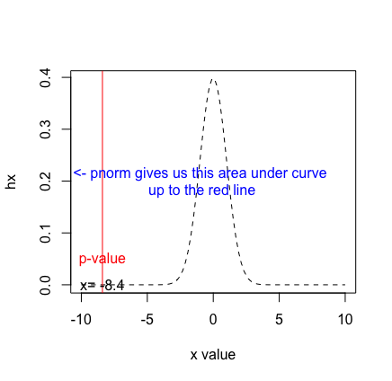

```{r}
library(ggplot2)
```

# (1) Read in the data

```{r}
birth<-read.csv("birthweight.csv", sep = ";")
```

# (2) Explore the data numerically and graphically

```{r}
summary(birth)
```

This data has 4 attributes as expected. The numerical summaries don't highlight any issues related to the columns, such as missing values or extreme/skewed values.

# Visualise the data 

The next step is to visualise this data (explore it graphically). It is possible to use a histogram to look at each variable's distribution.

```{r}
ggplot(data=birth, aes(x=bw)) + geom_histogram(bins = 20) + theme_classic() +ggtitle("Histogram of BirthWeight")
```

```{r}
ggplot(data=birth, aes(x=bpd)) + geom_histogram(bins = 20) + theme_classic() +ggtitle("Histogram of BPD")
```

```{r}
ggplot(data=birth, aes(x=ad)) + geom_histogram(bins = 20) + theme_classic() +ggtitle("Histogram of AD")
```

The variable idnr is just an identifier, so not useful for the analysis.

The three histograms show us that bw and ad seem to have a symmetric normal-like distribution, whereas bpd is skewed to the right. There are no visible extreme outliers to consider at the moment.
(In real world situations this would be a good output to share with the clinicians for them to confirm that the data looks as expected)

Now we can move to plotting the relationship between the three columns:

```{r}
ggplot(birth, aes(x=bw, y=bpd))+ geom_point() + theme_bw() + ggtitle("Birthweight vs Bipartiel Diameter")

```
```{r}
ggplot(birth, aes(x=bpd, y=ad))+ geom_point() + theme_bw() + ggtitle("Biparietal diameter vs the Abdominal Diameter")
```
```{r}
ggplot(birth, aes(x=bw, y=ad))+ geom_point() + theme_bw() + ggtitle("Birthweight vs. Abdominal diameter")
```
There seems to be potenital for linear relations betwen the attributes.

# Correlation

In order to assess the strength of the linear relation between BW and each of the other variables in turn we can use the correlation. 

```{r}
cor(birth$bw, birth$bpd)
```

```{r}
cor(birth$bw, birth$ad)
```

and we can also test if these correlations are significant

```{r}
cor.test(birth$bw, birth$bpd)
```

```{r}
cor.test(birth$bw, birth$ad)
```

Both correlations are significant, but the one betwen BW and AD appears stronger.

# Build two regression models

The birth weight (BW) is our dependent variable as this is what we would want to predict based on the other measurements.

```{r}
ad.lm<-lm(birth$bw~birth$ad)
summary(ad.lm)
```

and the graphical diagnostics

```{r}
plot(ad.lm)
```
This model can be written as:
$$bw=-2867.92+55.12\times ad $$
There is a positive relation between bw and ad. An increase of 1 in ad results in an estimated increase of 55.12 in the bw.

This first model has significant coefficients, a significant difference in the SSR SSE ratio (see F-Test) and a high $r^2$. The diagnostic plots do not point to major issues with the model, but there are some possible values that look like outliers (row 9).

Lets build the second model with bpd as the explanatory variable:

```{r}
bpd.lm<-lm(birth$bw~birth$bpd)
summary(bpd.lm)
```

```{r}
plot(bpd.lm)
```
This model can be written as:

$$bw=-5505.41+92.14\times bpd $$

We can see that there is a positive relation between the bpd and the bw. An increase in 1 in bpd results in an estimated bw increase of  92.14.

This model also has significant coefficients, a significant difference in the SSR SSE ratio (see F-Test) and a high $r^2$. The diagnostic plots do not point to major issues with the model, but the first plot could be a clue that there is a pattern in the residuals. The $r^2$ is also lower than the previous model.

# (5) Comparing the two models.  Which is better at predicting and why?

The $R^2$ is higher for the model that uses AD. But both are good models.The diagnostic plots are acceptable in both cases, however in our first model there is potential to investigate outliers and in the second model there is a pattern in the residuals that may warrant a transformation. In this case the model that uses AD would be preferred for predicting, as it has a higher $r^2$.

# (6) Try some transformations

There is a pattern in the model that uses BPD, see the residuals (first diagnostic plot), perhaps a polynomial model would be an effective option?

Note: I() is a way of computing the transformation as part of the model definition. It means we dont actually need to create a new column in the data to contain the transformation.


```{r}
bpd.tr.lm<-lm(birth$bw~I(birth$bpd^2))
summary(bpd.tr.lm)
```

```{r}
plot(bpd.tr.lm)
```

This transformation has improved the situation marginally. The $r^2$ has increased and the trend in the residuals is less strong (but not completely gone). We may want to try a more complex model that uses both the bpd and transformations of it. (We will discuss this when we cover multiple regression)


# (7) An expectant mother has been told their baby's bpd is 80 - what is the estimated birthweight? 
Explain your answer, including which model you used and why

The second model should be used as it does map the relation between the attribute we have a value for and our dependent variable (BW).

```{r}
bpd.lm
```

From the model coefficients we can see that the relation between bw and bpd is:

$$bw=-5505.41+92.14\times bpd $$

So to compute this:

```{r}
bw.80<--5505.41+92.14*80
bw.80
```

An expectant mother's estimated baby birthweight is 1866 gr if her bpd is 80.

# (8) An expectant mother has been told their's ad is 105 - what is the estimated birthweight? 
Explain your answer, including which model you used and why

The first model should be used as it does map the relation between the attribute we have a value for and our dependent variable (BW).

```{r}
ad.lm
```

So to predict a BW we can use the coefficients to write out the relationship:

$$bw=-2867.92+55.12\times ad $$

```{r}
bw.105<--2867.92+ 55.12*105
bw.105
```

THe estimated birth weight for an AD=105 is 2919 grams.

# (9) The mean birth weight in the UK is 3300 gr, given this sample of data test this hypothesis.

The hypothesis to test can be $H_0: \mu=3300$ and $H_1: \mu < 3300$
This is a one sided test as the mean in the sample is smaller than the UK one.
The mean in the sample is:

```{r}
mean(birth$bw)
```

The test statistic to use in this case is based on Z (as we have more than 30 measurements in our sample):

```{r}
test.st<-(mean(birth$bw)-3300)/(sd(birth$bw)/sqrt(107))
test.st
```

Then we can find how likely this test statistic using Z (the standardised normal distribution)

```{r}
pnorm(test.st)
```

```{r figurename, echo=FALSE, fig.cap="The test statistic on the Normal distribution", out.width = '90%'}

```


The result of pnorm(test statistic) gives us the probability of having such a value or more extreme (in this case smaller), see figure 1. Such a sample mean is very unlikely as the p-value is extremely small. Therefore based on this sample we would reject the Null Hypothesis.

In practice this wont mean that the mean birth weight for babies in the UK will be changed as there are 600 000 (approx) births a year and this sample was only containing 107 (The power of this test is not high). 
This result would likely lead to the need to take a much larger sample to confirm the result, and also to check whether the sample we used was in some way biased. We could have been sampling from "low weight" or clinically complex situations, that would explain this lower mean.


